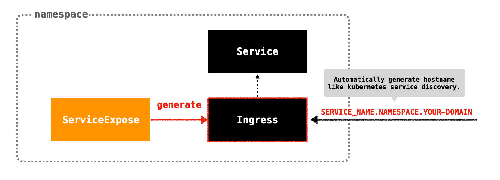
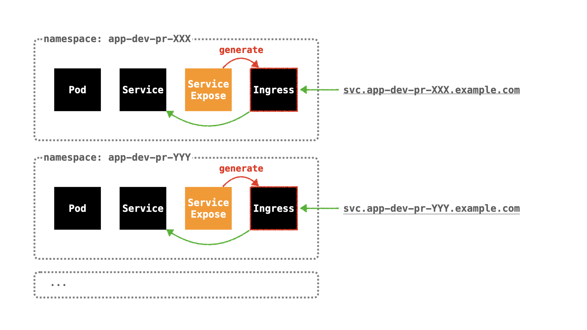

# service-expose-operator

Operator to expose service with ingress.
Automatically generate hostname like kubernetes service discovery.



# Usage

Create `ServiceExpose`.

```yaml
apiVersion: service-expose.takumakume.github.io/v1alpha1
kind: ServiceExpose
metadata:
  name: example
  namespace: default
spec:
  backend:
    service:
      name: example-svc
      port:
        number: 80
  path: /
  pathType: Prefix
  domain: example.com
  tlsEnable: true
  tlsSecretName: example-tls
  annotations:
    cert-manager.io/cluster-issuer: letsencrypt
```

Generate `Ingress`.
Automatically generate hostname like kubernetes service discovery.

```yaml
apiVersion: networking.k8s.io/v1
kind: Ingress
metadata:
  name: example-svc
  namespace: default
  annotations:
    cert-manager.io/cluster-issuer: letsencrypt
  labels:
    app.kubernetes.io/managed-by: serviceexpose
  ownerReferences:
  - apiVersion: service-expose.takumakume.github.io/v1alpha1
    blockOwnerDeletion: true
    controller: true
    kind: ServiceExpose
    name: echoserver
    uid: a0596760-4ed9-4ab1-aec4-9e1f9af9f644
spec:
  rules:
  - host: example-svc.default.example.com
    http:
      paths:
      - backend:
          service:
            name: echoserver
            port:
              number: 80
        path: /
        pathType: Prefix
  tls:
  - hosts:
    - example-svc.default.example.com
    secretName: example-tls
```

## Annotations

### `service-expose.takumakume.github.io/host-template`

overrides the `Ingress` hostname generation pattern.
value is in go-template format

default: `{{ .backendName }}.{{ .namespace }}.{{ .domain }}`

*Template variables:*

variable | discription
---      | ---
`.backendName` | name of the Service or other resource specified in ServiceExpose
`.namespace` | value of `.metadata.namespace` in ServiceExpose
`.domain` | value of `.spec.domain` in ServiceExpose

## Use case

### Preview environments

For example, there is a project managed by Kustomize.

```
manifests
├── base
│   ├── kustomization.yaml
│   ├── sample-app.deployment.yaml
│   ├── sample-app.namespace.yaml
│   └── sample-app.service.yaml
└── overlays
    └── development
        ├── kustomization.yaml
        └── sample-app.serviceexpose.yaml # ServiceExpose generates Ingress
```

We want to create manifests for development and generate a preview environment for each Pull-Request.
We have succeeded in creating an environment triggered by Pull-Request using kustomize, ArgoCD and etc ...
However, I couldn't find a declarative method to change the Ingress host rule for each environment.
This software can solve it.


